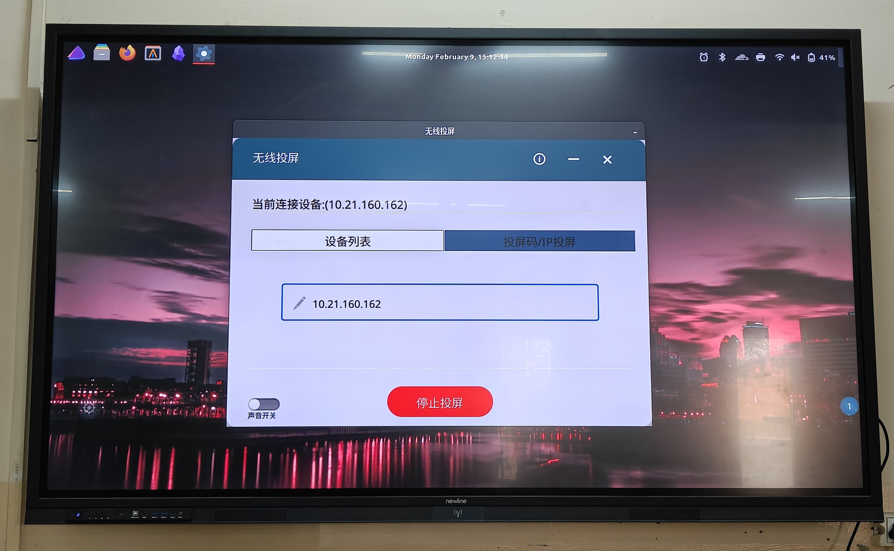

## The Problem
I wanted to run [Transcreen](https://transcreen.app/) (a wireless screen casting app for smartboards) on EndeavourOS but there was no official package for Arch Linux.
I tried installing it via
- [**AUR Package**](https://aur.archlinux.org/packages/transcreen) - this is 3 years old and won't launch
- Converted `.deb` with `debtap` - installed it but same thing it won't launch

So, I tried running it via `/opt/Transcreen/Transcreen` and got the following errors.

```bash
$ /opt/Transcreen/Transcreen
No PulseAudio daemon running, or not running as session daemon.
fopen: No such file or directory
fopen: No such file or directory
[INFO]2026-02-09 21:18:27.666: InitTFFControler() call InitHidManager()!
fopen: No such file or directory
fopen: No such file or directory
[INFO]2026-02-09 21:18:27.676: InitTFFControler() where strServerId=,value=
fopen: No such file or directory
[INFO]2026-02-09 21:18:27.676: InitTFFControler() Call Broadcast
[INFO]2026-02-09 21:18:27.677: InitTFFControler() Call HeartBeat
[INFO]2026-02-09 21:18:27.677: InitTFFControler() Call PaPa
[INFO]2026-02-09 21:18:27.677: InitTFFControler() Call Video
[INFO]2026-02-09 21:18:27.677: InitTFFControler() Call Audio
[INFO]2026-02-09 21:18:27.678: InitTFFControler() Call PPT
[INFO]2026-02-09 21:18:27.678: InitTFFControler() end
cat: /etc/redhat-release: No such file or directory
../SreenCast/TFFAudioManager.cpp: pa_simple_new() failed: Invalid argument
Assertion 'p' failed at pulse/simple.c:315, function pa_simple_read(). Aborting.
[1]    4815 IOT instruction (core dumped)  ./Transcreen
```
***I also tested the official `.deb` on LinuxMint too but same crash. Seems like this isn't an Arch specific issue; it affects any distro using PipeWire instead of PulseAudio.***

## My System
- EndeavourOS with Niri (Wayland) & Cinnamon (X11)
- PipeWire
- Installed transcreen via `debtap`

## Fixes I tried

*The following steps were all performed on Niri (Wayland).*

### Forced the app to use XWayland
I first installed this package 
```bash
sudo pacman -S xorg-xwayland
```
And then launched transcreen again via this
```bash
QT_QPA_PLATFORM=xcb ./AppRun
```
But similar error as above.


### PulseAudio Crash (Main Culprit)

The last few lines had this error.

```bash
../SreenCast/TFFAudioManager.cpp: pa_simple_new() failed: Invalid argument
Assertion 'p' failed at pulse/simple.c:315, function pa_simple_read(). Aborting.
[1]    4815 IOT instruction (core dumped)  ./Transcreen
```
I installed `apulse`

```bash
sudo pacman -S apulse
```
and then ran this

```bash
QT_QPA_PLATFORM=xcb apulse ./AppRun
```
and I got this error

```bash
fopen: No such file or directory
fopen: No such file or directory
[INFO]2026-02-09 22:19:08.929: InitTFFControler() call InitHidManager()!
fopen: No such file or directory
fopen: No such file or directory
[INFO]2026-02-09 22:19:08.940: InitTFFControler() where strServerId=,value=
fopen: No such file or directory
[INFO]2026-02-09 22:19:08.940: InitTFFControler() Call Broadcast
[INFO]2026-02-09 22:19:08.940: InitTFFControler() Call HeartBeat
[INFO]2026-02-09 22:19:08.940: InitTFFControler() Call PaPa
[INFO]2026-02-09 22:19:08.941: InitTFFControler() Call Video
[INFO]2026-02-09 22:19:08.941: InitTFFControler() Call Audio
[INFO]2026-02-09 22:19:08.941: InitTFFControler() Call PPT
[INFO]2026-02-09 22:19:08.941: InitTFFControler() end
cat: /etc/redhat-release: No such file or directory
pactl: symbol lookup error: pactl: undefined symbol: pa_context_send_message_to_object, version PULSE_0
../SreenCast/TFFAudioManager.cpp: pa_simple_read() failed: Oops.
../SreenCast/TFFAudioManager.cpp: pa_simple_read() failed: Oops.
[1]    9826 segmentation fault (core dumped)  QT_QPA_PLATFORM=xcb apulse ./AppRun
```

Now I got slightly different errors. Then I ran this to create a fake pulseaudio library
```bash
cat > /tmp/fake_pulse.c << 'EOF'
#include <stddef.h>
#include <stdio.h>

typedef struct pa_simple pa_simple;

pa_simple* pa_simple_new(void* a, void* b, int c, void* d, void* e, void* f, void* g, void* h, int* error) {
    printf("fake pa_simple_new called\n");
    if (error) *error = 0;
    return (pa_simple*)0xDEADBEEF; // Return fake pointer
}

int pa_simple_read(pa_simple* s, void* data, size_t bytes, int* error) {
    if (error) *error = 0;
    return 0; // Success
}

void pa_simple_free(pa_simple* s) {
    printf("fake pa_simple_free called\n");
}

int pa_simple_write(pa_simple* s, const void* data, size_t bytes, int* error) {
    if (error) *error = 0;
    return 0;
}

const char* pa_strerror(int error) {
    return "No error (fake)";
}
EOF
```
and then
```bash
gcc -shared -fPIC -o /tmp/libfake_pulse.so /tmp/fake_pulse.c
```
and again ran transcreen using this
```bash
LD_PRELOAD=/tmp/libfake_pulse.so QT_QPA_PLATFORM=xcb ./AppRun
```

Now, finally the application launched, I had a window running!


But it was in Chinese and I dont know chinese!

### Attempted to enable English

Here are the files `ls /opt/Transcreen` in

```bash
doc  plugins  translations  config.ini  default.desktop  Transcreen
lib  qml      AppRun        cursor.png  qt.conf
```
I tried modifying `config.ini` which had the following content.
```bash
[CONFIG]
##################################################
################# 【基本配置信息】 ###############
##################################################
# 语言设置
language=1
# 镜像投屏授权
Autoaccept=1
```
So, tried changing the value of `language` to `0`, `2`, `3`, `-1`, `en`, `eng` and `english` but it was still in chinese.

Tried forcing english 
```bash
LANG=en_US.UTF-8 LC_ALL=en_US.UTF-8 LD_PRELOAD=/tmp/libfake_pulse.so QT_QPA_PLATFORM=xcb ./AppRun
```
but failed.  

Also tried finding any other config files in `~/.config/Transcreen` but it didn't existed.

***At this point, I thought fine I'm gonna use it in chinese as long as it works I'm good and made this simple translation guide for myself.***


Also, make sure to allow the firewall for the application according to your distro. I used this
```bash
sudo firewall-cmd --add-service=mdns --permanent
sudo firewall-cmd --reload
```
And now I'm good to go.

### Black Screen on Niri

Now it was time to test it. I tried sharing my screen via Niri and got a **BLACK screen**.

I thought maybe the application was faulty, so I switched to Cinnamon and tried again and **it worked perfectly**.

So the issue was specific to Wayland. I tried installing screen capture portals:
```bash
sudo pacman -S xdg-desktop-portal xdg-desktop-portal-gnome
```

Configured portal preferences in `~/.config/xdg-desktop-portal/portals.conf`:
```ini
[preferred]
default=gnome;gtk
org.freedesktop.impl.portal.ScreenCast=gnome
```

Restarted the portal:
```bash
systemctl --user restart xdg-desktop-portal
```

Still black screen. Tried a few more compatibility tweaks but nothing worked.

**The reason:** Transcreen uses old X11 screen capture APIs that don't support modern Wayland compositors. There's no fix for this without the developers rewriting the app to use PipeWire screencasting.

**Bottom line:** You need an X11 DE or WM to use Transcreen.

And that's where I am right now - it works great on Cinnamon, but not on my preferred Niri setup.

## Success ...well kinda!

*Prerequisites: Any X11 DE or WM*  

Here is the final stuff that worked:  

**Step-1**: Run the following commands to create a fake pulseaudio library
```bash
cat > /tmp/fake_pulse.c << 'EOF'
#include <stddef.h>
#include <stdio.h>

typedef struct pa_simple pa_simple;

pa_simple* pa_simple_new(void* a, void* b, int c, void* d, void* e, void* f, void* g, void* h, int* error) {
    printf("fake pa_simple_new called\n");
    if (error) *error = 0;
    return (pa_simple*)0xDEADBEEF; // Return fake pointer
}

int pa_simple_read(pa_simple* s, void* data, size_t bytes, int* error) {
    if (error) *error = 0;
    return 0; // Success
}

void pa_simple_free(pa_simple* s) {
    printf("fake pa_simple_free called\n");
}

int pa_simple_write(pa_simple* s, const void* data, size_t bytes, int* error) {
    if (error) *error = 0;
    return 0;
}

const char* pa_strerror(int error) {
    return "No error (fake)";
}
EOF
gcc -shared -fPIC -o /tmp/libfake_pulse.so /tmp/fake_pulse.c
```
make it permanent
```bash
sudo mkdir -p /opt/Transcreen/lib/custom
sudo mv /tmp/libfake_pulse.so /opt/Transcreen/lib/custom/
```

**Step-2**: Create a permanent script by running the following
```bash
sudo nano /usr/local/bin/transcreen
```
remove existing data and add the following
```bash
#!/bin/bash
cd /opt/Transcreen
LD_PRELOAD=/opt/Transcreen/lib/custom/libfake_pulse.so QT_QPA_PLATFORM=xcb /opt/Transcreen/AppRun "$@"
```
Press `Ctrl+X`, then `y` and finally press `enter` to save the file.

Make it executable:
```bash
sudo chmod +x /usr/local/bin/transcreen
```

**Step-3**: Create a desktop entry
```bash
sudo nano /usr/share/applications/transcreen.desktop
```
add this data
```bash
[Desktop Entry]
Name=Transcreen
Comment=Wireless Screen Casting
Exec=/usr/local/bin/transcreen
Icon=/opt/Transcreen/cursor.png
Terminal=false
Type=Application
Categories=Network;AudioVideo;
```

**Step-4**: Allow transcreen through the firewall. I use `firewall-cmd`, check what your system uses.
```bash
sudo firewall-cmd --add-service=mdns --permanent
sudo firewall-cmd --reload
```

**Step-5**: Launch the application either via terminal or via the application launcher(if you added a desktop entry at step-4)
```bash
transcreen
```
Now, get in the same network and enter the device IP shown on the smartboard and press the big blue button at the bottom to share the screen.

Here is a picture of it running,


## Conclusion
I thought to myself that I only have to share my screen rarely and I have already invested so much time debugging it. It works flawlessly now on Cinnamon tho but I really wanted it running on Niri. But this is it for now, maybe in future I will pick this up again and work on it.  
This was such an amazing debugging session that I had. Got to learn about so many things that I never thought even existed, glad that I finally switched to EndeavourOS from LinuxMint 2 months ago. In the past few months, I learned so many things that I hadn't in the past few years.

---

**Note:** I used Claude AI to help troubleshoot and document this process. The debugging was collaborative as I ran the commands and reported errors, while Claude suggested fixes and explained why things were failing.