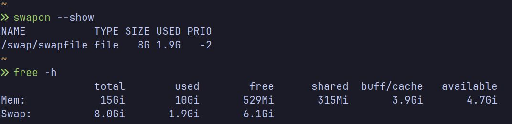

## Why?

A few months ago, I shifted from Linux Mint to EndeavourOS because I wanted to learn more about Linux and try Arch, especially the AUR. While installing EndeavourOS, I picked Btrfs because I heard good things about it, like easy snapshots. So far, I had only dealt with ext4, so I thought, “Why not?” So I went with it, but completely forgot about swap. 

Last week, I had Firefox and Brave with 30+ tabs opened in each, and multiple other stuff running in the background, which had taken more than 70% of the RAM, I presume. With all this running in the background, I launched Heroic Games Launcher and started *Marvel’s Spider-Man Remastered*, and my whole system froze. I tried pressing everything I knew, but nothing happened. Ultimately, I had to turn off the power supply and restart the PC to make sure everything works. Everything worked after the reboot. 

At that moment, I realized I hadn’t set up a swapfile yet, which caused this issue. It’s been more than 2 months since I installed EndeavourOS and I didnt have any swap. To make sure this never happens again, I have now added swap file.

## Steps

- Create a subvolume:
    ```bash
    sudo btrfs subvolume create /swap
    ```

- Create a swap file:
    ```bash
    sudo btrfs filesystem mkswapfile --size 8g --uuid clear /swap/swapfile
    ```
    > [!TIP]+ How much swap?
    > If you have 16GB RAM or more, 8GB is enough for most cases.  
    > Otherwise just go with double the amount of RAM or same as RAM.  
    > Modify the `--size 8g` to your preferred size.

- Activate the swap file:

    ```bash
    sudo swapon /swap/swapfile
    ```

- Now, edit the `/etc/fstab` and add this entry:
    ```bash
    /swap/swapfile none swap defaults 0 0
    ```

**DONE!**

## Verify

You can use any of the following to check whether the swap was created or not

```bash
swapon --show
```
or
```bash
free -h
```
If you did everything correct, then the output should look like this:



## Conclusion

This process was much simpler than I expected but if you want to dive deeper, you can always read the [Arch Wiki](https://wiki.archlinux.org/title/Btrfs#Swap_file).  

I should've started with the Arch Wiki first but nope me being a 🤡, started with Claude then EndeavourOS Wiki then Claude then Arch Wiki. The solution was so straightforward that now I realize how much time I wasted when I could've gotten my solution easily. From now on, I will first search Arch Wiki then move on to something else.  

Anyways, with these easy steps, the swapfile setup is done! Now I can easily open too many stuff at once again without worrying about any freezes or crashes. :)

## References

- [Arch Wiki: Btrfs#swap_file](https://wiki.archlinux.org/title/Btrfs#Swap_file)
- [EndeavourOS Wiki: Adding swap after installation](https://discovery.endeavouros.com/storage-and-partitions/adding-swap-after-installation/2021/03/)